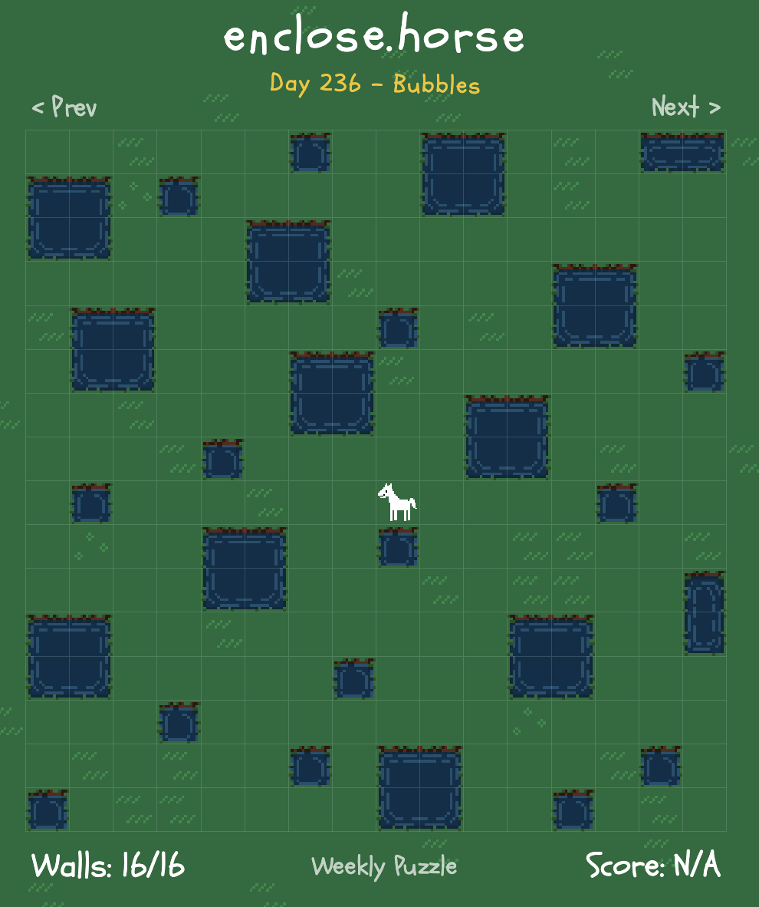
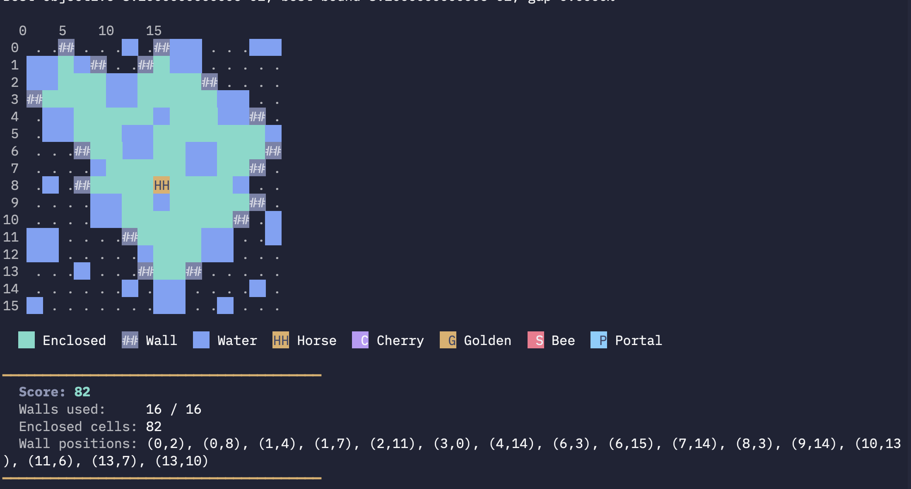

+++
date = '2026-08-22T14:36:28-04:00'
draft = false
title = 'Enclosing a Horse'
math = true
+++



### A new daily game
Somewhere between Wordle and the NYT crossword, I stumbled onto [enclose.horse](https://enclose.horse). One of my coworkers (shoutout Alex!) first taught me how to play. There's a horse loose on a grid of grass and water, and you have a limited budget of walls to place. The horse can walk in the four cardinal directions across grass, gets blocked by water and walls, and can teleport through matching portals. Naturally. The goal is to place walls such that the horse is *enclosed*, as the name suggests, so that no path from the horse reaches the edge of the grid. Your score is characterized by the number of things enclosed with the horse. Each cell of grass enclosed with the horse is worth $1$, cherries are worth $4$, golden apples $11$, and bee swarms *cost* $4$.

I played it with my coworkers by hand for a few days before we asked the obvious question: who can make the best solver? My second instinct was integer programming (simulated annealing did NOT do well on average on this problem lol); this post will detail the model I came up with and the performance of the associated program.

### What variables to choose?
Since we're *maximizing score*, it's pretty clear what we want our objective to be.

For a grid with $R$ rows and $C$ columns, and a wall budget of $B$, we introduce two families of binary variables. For each cell $(r,c)$:
$$
\begin{cases}
w[r][c] = 1 && \text{we place a wall on }(r,c) \\\\
w[r][c] = 0 && \text{otherwise}
\end{cases}
$$
$$
\begin{cases}
e[r][c] = 1 && (r,c)\text{ is enclosed with the horse} \\\\
e[r][c] = 0 && \text{otherwise}
\end{cases}
$$

Our objective is exactly what the game asks for:
$$
\text{maximize} \sum_{(r,c)\text{ grass}} v_{r,c} \cdot e[r][c]
$$
where $v_{r,c}$ is the cell's score contribution.

We have several constraints that are very instinctive and bookkeeping-ish, while one of them is a little less obvious.

### Easy Constraints
Of course, the number of walls we place must be less than or equal to $B$.
$$
\sum_{r,c} w[r][c] \leq B
$$

A cell isn't allowed to be both a wall and enclosed:
$$
\forall (r,c),\ w[r][c] + e[r][c] \leq 1
$$

The horse itself must be enclosed and cannot be a wall:
$$
e[r_h][c_h] = 1,\quad w[r_h][c_h] = 0
$$

Grass cells on the boundary of the grid can't be enclosed, as the horse could just walk off the edge:
$$
e[r][c] = 0 \quad \text{for any }(r,c)\text{ on the boundary}
$$

### Last Constraint
This is where I spent most of my time on the model. "Enclosed" actually means "cannot reach the boundary." Equivalently, if a grass cell $(r,c)$ is enclosed, then every grass neighbor is either *also enclosed* or *is a wall*. For every grass, non-boundary cell $(r,c)$ and every grass neighbor $(r^\prime,c^\prime)$:
$$
e[r][c] \leq e[r^\prime][c^\prime] + w[r^\prime][c^\prime]
$$

It's important to note here that a grass neighbor would also mean portal exits. A portal pair means stepping into one puts the horse at the other, and vice versa.

### Disconnected Islands
The constraints so far define a valid enclosure; however, all cells in the proposed enclosure aren't necessarily reachable by the horse. Suppose we had a disconnected island, surrounded by water. According to our previous constraints, the solver would claim these points, despite the horse not being able to reach these cells.

We can solve this with flow. Let the horse be a source, and every other enclosed cell a sink that soaks up exactly one unit. For every directed edge $u \to v$ between grass cells, we introduce a continuous flow variable $f_{u \to v} \geq 0$.

Flow can only travel through enclosed cells:
$$
f_{u \to v} \leq N \cdot e[u],\quad f_{u \to v} \leq N \cdot e[v]
$$
where $N = R \cdot C$ upper-bounds the flow across any edge.

The flow leaving the horse minus the flow entering the horse will be equal to the total number of enclosed cells minus 1, since the horse is the source.
$$
\sum_v f_{h \to v} - \sum_v f_{v \to h} = \left(\sum_{r,c} e[r][c]\right) - 1
$$

For grass cells other than the horse's cell, we also need conservation. If a grass cell is enclosed, the entering flow minus the leaving flow must equal 1.
$$
\sum_v f_{v \to u} - \sum_v f_{u \to v} = e[u]
$$

If a cell is enclosed but *not* reachable from the horse through other enclosed cells, the model is forced to set $e[r][c] = 0$. In this way, we solve the disconnected islands problem.

### How's the performance?
Previous projects have shown me that Gurobi is insanely fast. Even so: a typical $16 \times 16$ daily puzzle produces a model with roughly $2{,}300$ rows and $1{,}100$ columns, and the flow variables in particular felt like they might slow things down.

Gurobi saved the day again. The program typically runs in well under a tenth of a second.

One more farmer saved!
