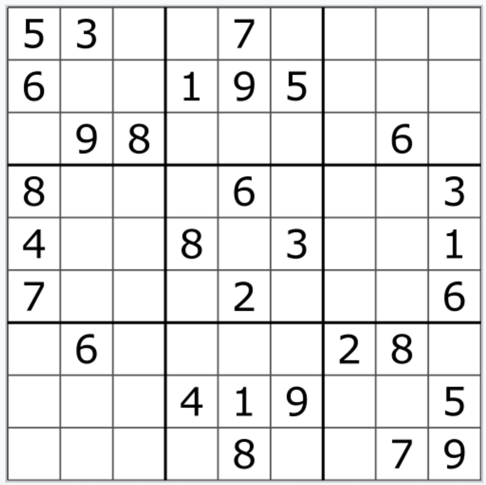
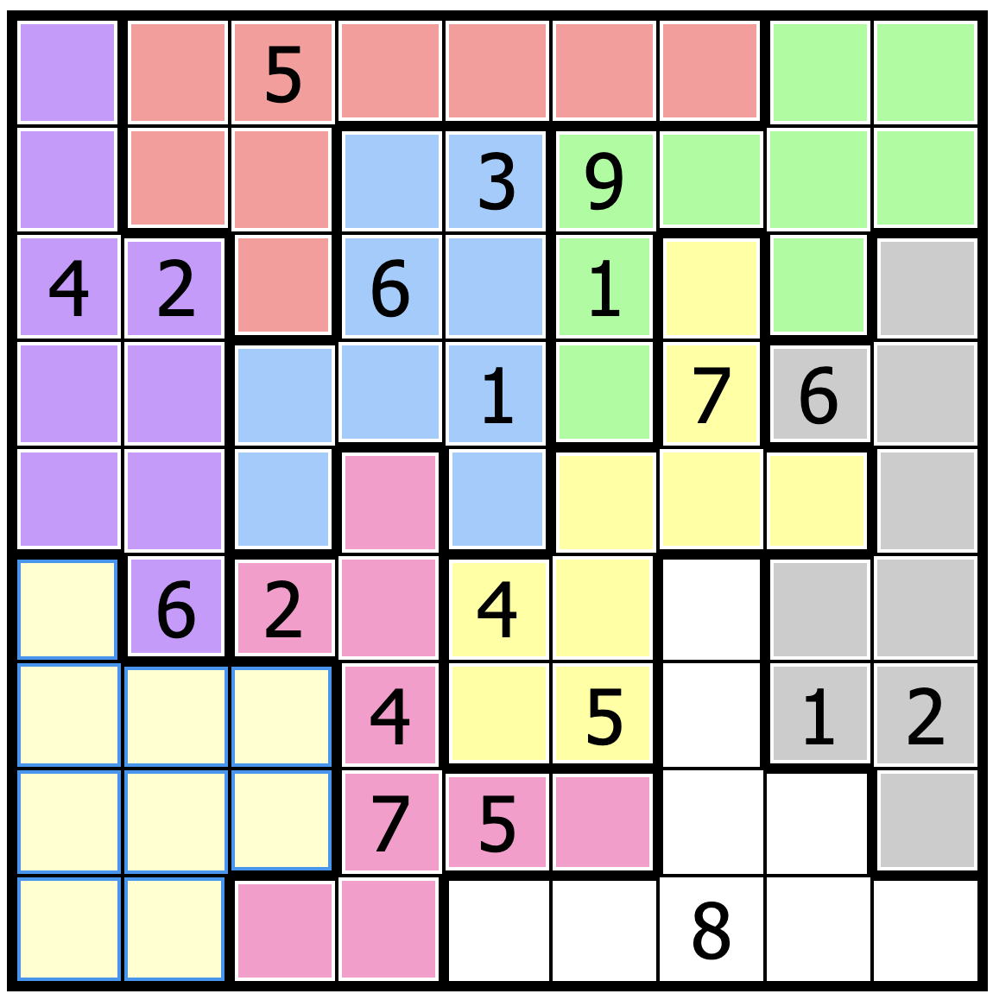

+++
date = '2026-04-13T15:15:12-04:00'
draft = false
title = 'Jigsaw Sudoku'
math = true
+++



### Lucas, the Sudoku Wizard
The path to knowledge often takes many twists and turns. I encountered one of these in the form of a challenge, offered to me by colleague and friend Lucas Hunter.

Lucas mentioned Jigsaw Sudoku as an alternative to classic Sudoku; the only difference between the two is found in the location and structure of the subgrids. Classic Sudoku forces each subgrid to be a $3\times3$ square, which in turn form a $3\times3$ square of subgrids. An image is included below for the uninitiated.

### What's the difference?

  
  
Typical Sudoku involves determining the value contained within each cell. There are several rules: each row has exactly one of each digit, each column has exactly one of each digit, and each subgrid has exactly one of each digit.

  
Jigsaw Sudoku turns this on its head. Instead of requiring structure in the subgrids, we allow the subgrids to take any configuration, as long as the subgrid is connected and contains $9$ cells. In the image to the right, each colored section is a separate subgrid.

  

Classic Sudoku is quickly solved with both backtracking/recursion and linear programming. Both strategies are known to be exponential in time as grid size increases. However, linear programming is particularly elegant for the Jigsaw Sudoku problem.

### What variables to choose?
Having previously worked on the linear programming formulation for classical Sudoku, I had a hunch for what variables to choose before starting work on the constraints. For this formulation, I'll consider a grid size of $9$ (although this formulation works for an arbitrarily sized grid!). Recall that we are searching for a feasible solution, rather than an optimal solution, so we won't consider an objective function for any of our variables.

We start off with a $9\times9\times9$ array of binary variables; we'll call it $x[9][9][9]$ - note that all the constraints below are $1$-indexed, but any respectable implementation will be $0$-indexed. For $i,j,k\in\{1,...,9\}$ a cell $(i,j)$, the binary variable will have the following value: $$
\begin{cases}
x[i][j][k]=1 && (i,j)\text{ has the value } k \\
x[i][j][k]=0 && \text{otherwise}
\end{cases}
$$
We also introduce a second array of binary variables, which we'll call $a[9][9][9]$. The idea for this array is to tell us which subgrid a cell belongs to. So, for $i,j,k\in \{1,...,9\}$ and a cell $(i,j)$,$$
\begin{cases}
a[i][j][k]=1 && (i,j)\text{ belongs to the }k^{\text{th}}\text{ subgrid} \\
a[i][j][k]=0 && \text{otherwise}
\end{cases}
$$

### Subgrids, feasibility, and constraints, oh my!
Now that we have variables, what do we do with them? These variables won't solve the grid themselves! We have to impose <u>constraints</u>. In any solution, we will have exactly one value per grid. That is,
$$
\forall i,j \in \{1,...,9\}, \sum_{k=1}^9 x[i][j][k] =1
$$

Additionally, as expert sudoku players, we know that we have exactly one digit per column. We write this as:
$$
\forall j,k\in \{1,...,9\},\sum_{i=1}^9 x[i][j][k]=1
$$
Similarly, for our uniqueness/existence constraint for rows, we have:
$$
\forall i,k\in \{1,...,9\},\sum_{j=1}^9 x[i][j][k]=1
$$
All three of these constraints are fairly trivial. We didn't even have to utilize the second array of binary variables! However, we've arrived at the more non-trivial constraint - how do we express that we need exactly one digit per subgrid?

It's easier to think about problems like these by fixing a few variables. Fix $k, v\in \{1,...,9\}$. Then, exactly one cell should have both $x[i][j][k]=1$ and $a[i][j][v]=1$; that is, we constrain a single cell to have the value $k$ in the $v^{\text{th}}$ subgrid. Those of you with a little experience in logic might recognize this: a logical $\text{AND}$! Formalizing, we have the following constraint:
$$
\forall k,v\in \{1,...,9\}, \sum_{i=1}^9 \sum_{j=1}^9 a[i][j][k]\cdot x[i][j][v] = 1
$$
These are all the constraints we need!

### How's the performance?
I won't lie to you... sitting on my beanbag writing the C++ implementation of this algorithm with Gurobi (state-of-the-art optimization software), I was concerned that the large number of binary variables and constraints would pose a computational problem for my computer. Consider: we have not one, but TWO $729$ binary variable arrays in our model, as well as $348$ constraints for a $9\times9$ grid.

Gurobi eased my worries. The presolve alone took care of the entire system, presolving $348$ rows and $729$ columns in less than a hundredth of a second.

Another hypothetical win for the linear programming community!
